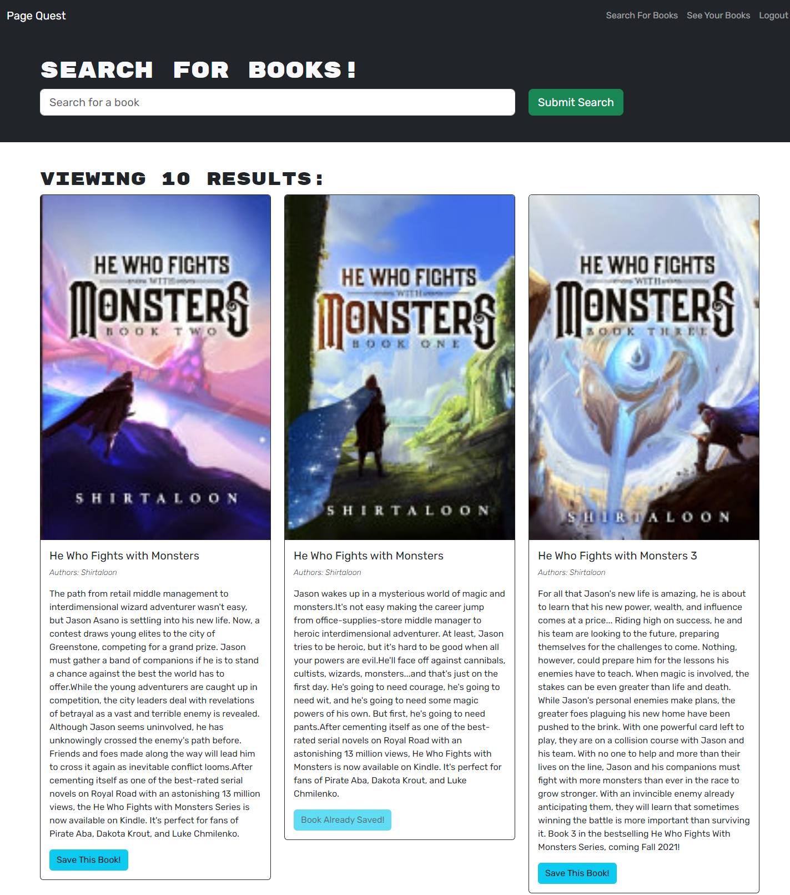

# Page Quest

## Description

This comprehensive application is a testament to the power of full-stack development, incorporating the Google Search API to provide users with an immersive book search experience. Designed as a dedicated space for individuals seeking books by their titles, this app offers robust functionalities, including the ability to query, save, and remove books within a personalized collection.

The driving motivation behind crafting this app was to enhance my proficiency in the intricate interplay between GraphQL, React, and Express, alongside an array of complementary technologies. By seamlessly connecting the frontend and backend aspects, I gained a deeper insight into building a cohesive user experience, all while harnessing the capabilities of modern web development tools. Also creating a way to keep track of books I want to read, and then removing them from my list once finished, gives me a great sense of accomplishment. I'm hoping this will benefit others as much as it has myself.

## Built With

- MongoDB
- Express
- React
- Node
- GraphQL
- Apollo
- Bootstrap

## Getting Started

To get a local copy up and running follow these simple example steps.

### Installation

- Clone the repo
  ```sh
  git clone git@github.com:erikbenedict/page-quest.git
  ```
- Install NPM packages
  ```sh
  npm i
  ```
- Run build
  ```sh
  npm run build
  ```
- Start the application
  ```sh
  npm run develop
  ```
- (!! IMPORTANT !!) Make sure to create a `.env` file in the root. Use the `.env.EXAMPLE` as a template to add your MySQL username, password, and session secrete to create the connection

## Usage

Embark on your literary journey with ease by initiating a search using book titles as your guide. Discover the books you seek and seamlessly save them for your reading pleasure. Dive into your curated collection of saved books to manage your reading list, keeping tabs on your upcoming literary explorations. And when you've completed a chapter of your reading adventure, effortlessly remove the book from your list, making room for your next captivating tale.

Below are screenshots of the application




## Deployed Application

[Click here to try Page Quest for yourself!](https://page-quest-5ece7789cee0.herokuapp.com/)

## Contributing

Contributions are what make the open source community such an amazing place to learn, inspire, and create. Any contributions you make are greatly appreciated.

If you have a suggestion that would make this better, please fork the repo and create a pull request. Don't forget to give the project a star! Thanks again!

1. Fork the Project
2. Create your Feature Branch (`git checkout -b feature/AmazingFeature`)
3. Commit your Changes (`git commit -m 'Add some AmazingFeature'`)
4. Push to the Branch (`git push origin feature/AmazingFeature`)
5. Open a Pull Request

## License

Distributed under the MIT License. See [MIT](https://choosealicense.com/licenses/mit/) for more information.

## Contact

If you have any questions please reach out via email!

- Email: erik.r.benedict@gmail.com
- Twitter: [@\_Erik_Benedict](https://twitter.com/_Erik_Benedict)
- Project Link: [https://github.com/erikbenedict/page-quest](https://github.com/erikbenedict/page-quest)
